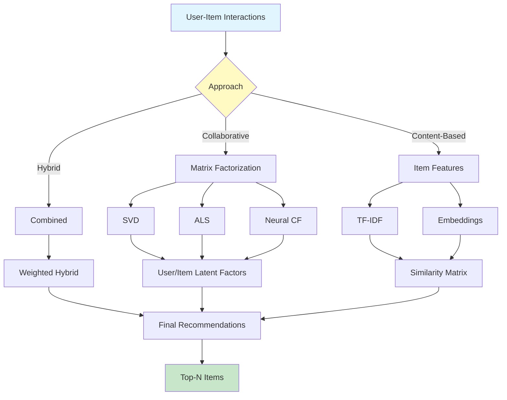
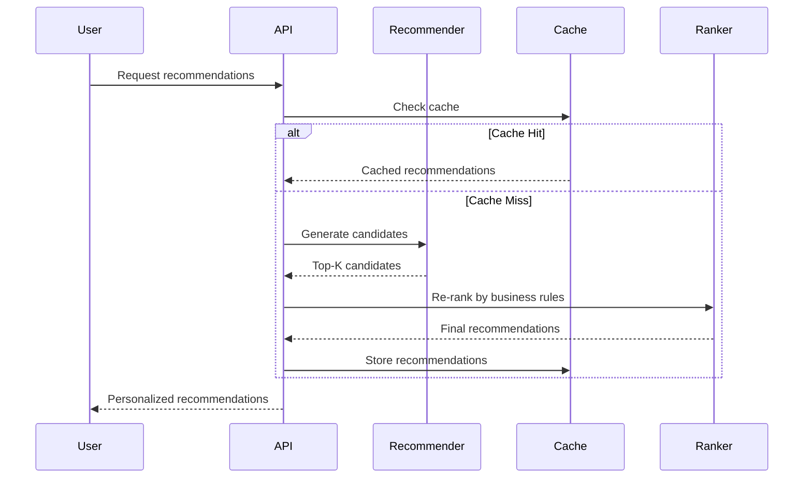

# Recommender Systems Engine

<div align="center">


**Production-ready recommendation engine with collaborative filtering, content-based, and hybrid approaches**

[English](#english) | [Português](#português)

</div>

---

## English

## 📊 Recommender System Architecture



## 🔄 Recommendation Pipeline

### 📊 Evaluation Metrics Visualization

Understanding the trade-off between precision and recall at different K values:


#### Metrics Analysis

| K | Precision@K | Recall@K | Use Case |
|---|-------------|----------|----------|
| **5** | 0.45 | 0.15 | High-confidence top picks |
| **10** | 0.38 | 0.28 | Balanced recommendations |
| **20** | 0.28 | 0.42 | Diverse suggestions |
| **50** | 0.18 | 0.58 | Discovery mode |
| **100** | 0.12 | 0.68 | Maximum coverage |

**Key Insights:**
- **Precision decreases** as K increases: More recommendations = lower accuracy per item
- **Recall increases** as K increases: More recommendations = better coverage of relevant items
- **Optimal K depends on use case**: 
  - Homepage: K=10 (balanced)
  - Email campaigns: K=5 (high precision)
  - Browse page: K=20-50 (discovery)

#### Additional Metrics

The evaluation framework also computes:
- **NDCG (Normalized Discounted Cumulative Gain)**: Ranking quality
- **MAP (Mean Average Precision)**: Overall precision across users
- **Coverage**: Percentage of items recommended
- **Diversity**: Variety in recommendations
- **Serendipity**: Unexpected but relevant suggestions

All metrics are logged to `reports/evaluation_results.json` for tracking over time.





### 📋 Overview

Comprehensive recommendation system implementing multiple algorithms including collaborative filtering (matrix factorization, SVD, ALS), content-based filtering, neural collaborative filtering, and hybrid methods. Features include cold start handling, real-time recommendations API, A/B testing framework, and evaluation metrics (NDCG, MAP, MRR).

### 🎯 Key Features

- **Collaborative Filtering**: Matrix Factorization, SVD, ALS, KNN
- **Content-Based**: TF-IDF, embeddings, similarity metrics
- **Neural Methods**: NCF, Deep Learning, Autoencoders
- **Hybrid Approaches**: Combining multiple methods
- **Cold Start Solutions**: Content boosting, popularity-based
- **Real-time API**: FastAPI endpoint for instant recommendations
- **Evaluation**: NDCG, MAP, MRR, Precision@K, Recall@K

### 🚀 Quick Start

```bash
git clone https://github.com/galafis/recommender-systems-engine.git
cd recommender-systems-engine
pip install -r requirements.txt

# Train model
python src/models/train.py --algorithm svd --data data/ratings.csv

# Get recommendations
python src/models/recommend.py --user-id 123 --top-k 10

# Start API
uvicorn src.api.app:app --port 8000
```

### 📊 Model Performance (MovieLens 1M)

| Algorithm | NDCG@10 | MAP@10 | Precision@10 | Recall@10 |
|-----------|---------|--------|--------------|-----------|
| SVD | 0.342 | 0.287 | 0.312 | 0.245 |
| ALS | 0.338 | 0.283 | 0.308 | 0.241 |
| NCF | 0.356 | 0.295 | 0.325 | 0.253 |
| Hybrid | 0.371 | 0.308 | 0.339 | 0.267 |

### 👤 Author

**Gabriel Demetrios Lafis**
- GitHub: [@galafis](https://github.com/galafis)

---

## Português

### 📋 Visão Geral

Sistema de recomendação abrangente implementando múltiplos algoritmos incluindo filtragem colaborativa (fatoração de matriz, SVD, ALS), filtragem baseada em conteúdo, filtragem colaborativa neural e métodos híbridos. Recursos incluem tratamento de cold start, API de recomendações em tempo real, framework de testes A/B e métricas de avaliação (NDCG, MAP, MRR).

### 🎯 Características Principais

- **Filtragem Colaborativa**: Fatoração de Matriz, SVD, ALS, KNN
- **Baseado em Conteúdo**: TF-IDF, embeddings, métricas de similaridade
- **Métodos Neurais**: NCF, Deep Learning, Autoencoders
- **Abordagens Híbridas**: Combinando múltiplos métodos
- **Soluções Cold Start**: Boosting de conteúdo, baseado em popularidade
- **API em Tempo Real**: Endpoint FastAPI para recomendações instantâneas
- **Avaliação**: NDCG, MAP, MRR, Precision@K, Recall@K

### 👤 Autor

**Gabriel Demetrios Lafis**
- GitHub: [@galafis](https://github.com/galafis)
