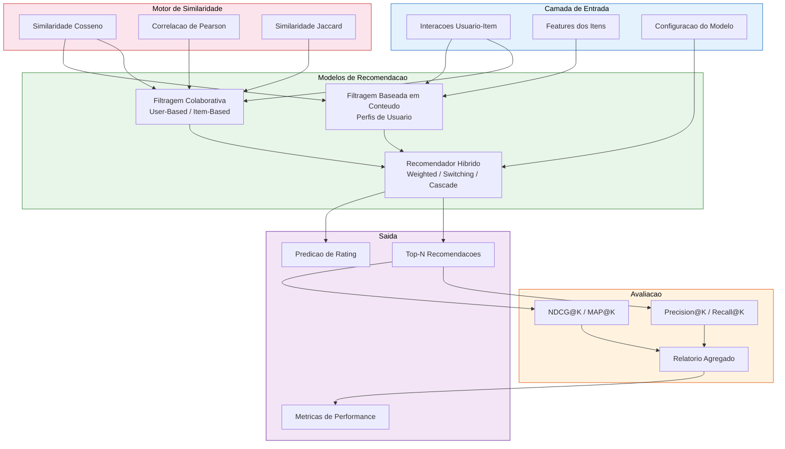
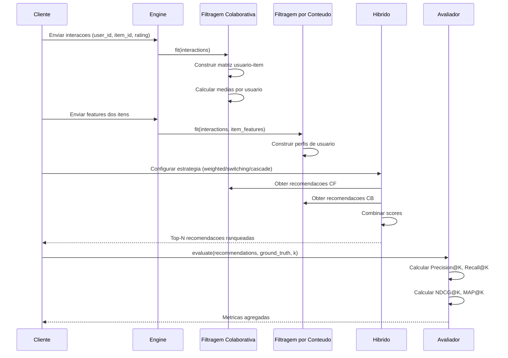
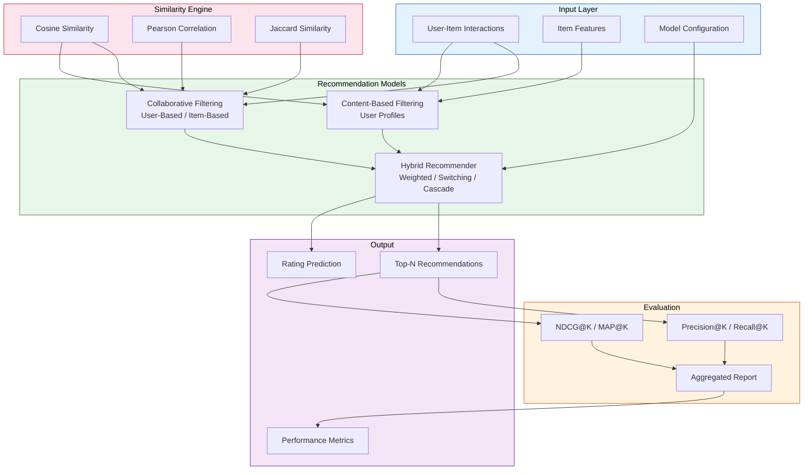
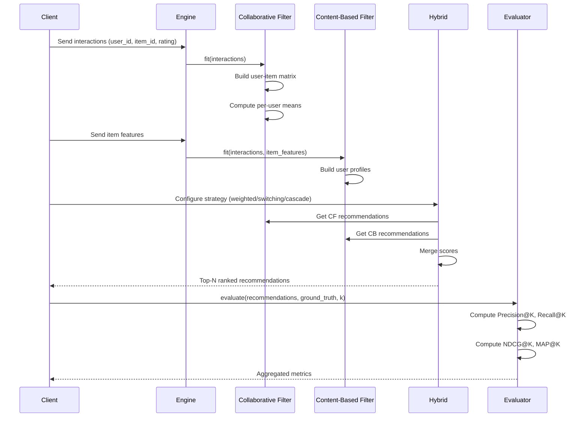

<div align="center">

# Recommender Systems Engine

**Motor de sistemas de recomendacao com filtragem colaborativa, baseada em conteudo e hibrida**

**Recommendation engine with collaborative, content-based, and hybrid filtering**

[](https://www.python.org/)
[](https://scikit-learn.org/)
[](https://numpy.org/)
[](https://pandas.pydata.org/)
[](https://pytorch.org/)
[](https://fastapi.tiangolo.com/)
[](LICENSE)
[](Dockerfile)

[Portugues](#portugues) | [English](#english)

</div>

---

## Portugues

### Sobre

O **Recommender Systems Engine** e uma biblioteca Python de nivel profissional que implementa os tres paradigmas fundamentais de sistemas de recomendacao: filtragem colaborativa (user-based e item-based), filtragem baseada em conteudo e abordagens hibridas. O projeto foi projetado para cenarios de producao, oferecendo modularidade, extensibilidade e metricas de avaliacao padrao da industria.

A engine utiliza uma arquitetura orientada a objetos com cinco classes principais que encapsulam metricas de similaridade (cosseno, Pearson, Jaccard), algoritmos de vizinhos mais proximos para filtragem colaborativa, perfis de usuario construidos a partir de vetores de features de itens, tres estrategias hibridas (ponderada, switching e cascade) e um framework completo de avaliacao com Precision@K, Recall@K, NDCG@K e MAP@K. O design permite encadear metodos, trocar metricas de similaridade e integrar com pipelines de dados existentes sem modificacoes estruturais.

### Tecnologias

| Tecnologia | Versao | Funcao |
|:-----------|:------:|:-------|
| **Python** | 3.12+ | Linguagem principal |
| **NumPy** | 1.26+ | Computacao vetorial e algebra linear |
| **Pandas** | 2.2+ | Manipulacao e analise de dados tabulares |
| **SciPy** | 1.10+ | Matrizes esparsas e distancias |
| **scikit-learn** | 1.4+ | Algoritmos de ML e preprocessamento |
| **Surprise** | 0.1+ | Algoritmos especializados de recomendacao |
| **implicit** | 0.7+ | Filtragem colaborativa para feedback implicito |
| **PyTorch** | 2.0+ | Modelos de deep learning para recomendacao |
| **TensorFlow** | 2.13+ | Redes neurais e embeddings |
| **FastAPI** | 0.100+ | API REST de alta performance |
| **uvicorn** | 0.22+ | Servidor ASGI assincrono |
| **pytest** | 7.3+ | Framework de testes automatizados |
| **Docker** | - | Containerizacao e implantacao |

### Arquitetura


```mermaid
graph TD
    subgraph INPUT["Camada de Entrada"]
        A[Interacoes Usuario-Item]
        B[Features dos Itens]
        C[Configuracao do Modelo]
    end

    subgraph SIMILARITY["Motor de Similaridade"]
        D[Similaridade Cosseno]
        E[Correlacao de Pearson]
        F[Similaridade Jaccard]
    end

    subgraph MODELS["Modelos de Recomendacao"]
        G[Filtragem Colaborativa<br/>User-Based / Item-Based]
        H[Filtragem Baseada em Conteudo<br/>Perfis de Usuario]
        I[Recomendador Hibrido<br/>Weighted / Switching / Cascade]
    end

    subgraph EVAL["Avaliacao"]
        J["Precision@K / Recall@K"]
        K["NDCG@K / MAP@K"]
        L[Relatorio Agregado]
    end

    subgraph OUTPUT["Saida"]
        M[Top-N Recomendacoes]
        N[Predicao de Rating]
        O[Metricas de Performance]
    end

    A --> G
    A --> H
    B --> H
    C --> I

    D --> G
    E --> G
    F --> G
    D --> H

    G --> I
    H --> I

    M --> J
    M --> K
    J --> L
    K --> L

    I --> M
    I --> N
    L --> O

    style INPUT fill:#e3f2fd,stroke:#1565c0,color:#000
    style SIMILARITY fill:#fce4ec,stroke:#c62828,color:#000
    style MODELS fill:#e8f5e9,stroke:#2e7d32,color:#000
    style EVAL fill:#fff3e0,stroke:#e65100,color:#000
    style OUTPUT fill:#f3e5f5,stroke:#6a1b9a,color:#000
```

### Fluxo de Recomendacao


```mermaid
sequenceDiagram
    participant C as Cliente
    participant E as Engine
    participant CF as Filtragem Colaborativa
    participant CB as Filtragem por Conteudo
    participant H as Hibrido
    participant EV as Avaliador

    C->>E: Enviar interacoes (user_id, item_id, rating)
    E->>CF: fit(interactions)
    CF->>CF: Construir matriz usuario-item
    CF->>CF: Calcular medias por usuario

    C->>E: Enviar features dos itens
    E->>CB: fit(interactions, item_features)
    CB->>CB: Construir perfis de usuario

    C->>H: Configurar estrategia (weighted/switching/cascade)
    H->>CF: Obter recomendacoes CF
    H->>CB: Obter recomendacoes CB
    H->>H: Combinar scores

    H-->>C: Top-N recomendacoes ranqueadas

    C->>EV: evaluate(recommendations, ground_truth, k)
    EV->>EV: Calcular Precision@K, Recall@K
    EV->>EV: Calcular NDCG@K, MAP@K
    EV-->>C: Metricas agregadas
```

### Estrutura do Projeto

```
recommender-systems-engine/
├── src/                          # Codigo-fonte principal
│   ├── __init__.py               #   Pacote raiz
│   ├── data/                     #   Carregamento e preprocessamento
│   │   └── __init__.py           #     Utilitarios de dados
│   ├── models/                   #   Modelos de recomendacao
│   │   ├── __init__.py           #     Exports publicos
│   │   └── recommender.py        #     Engine principal (~500 LOC)
│   └── utils/                    #   Funcoes auxiliares
│       └── __init__.py           #     Helpers
├── tests/                        # Suite de testes
│   ├── __init__.py               #   Pacote de testes
│   └── test_models.py            #   Testes unitarios + integracao (~470 LOC)
├── notebooks/                    # Notebooks exploratórios
│   └── 01_quick_start.ipynb      #   Guia de inicio rapido
├── data/                         # Diretorio de dados
│   ├── raw/                      #   Dados brutos
│   └── processed/                #   Dados processados
├── assets/                       # Recursos visuais
│   └── precision_recall_at_k.png #   Grafico de metricas
├── .env.example                  # Variaveis de ambiente modelo
├── .gitignore                    # Regras de exclusao Git
├── Dockerfile                    # Containerizacao Docker
├── LICENSE                       # Licenca MIT
├── pytest.ini                    # Configuracao pytest
├── requirements.txt              # Dependencias Python
├── setup.py                      # Configuracao do pacote
└── README.md                     # Documentacao do projeto
```

**Total: ~1.170 linhas de codigo** (500 engine + 470 testes + 200 configuracao)

### Inicio Rapido

```bash
# Clonar o repositorio
git clone https://github.com/galafis/recommender-systems-engine.git
cd recommender-systems-engine

# Criar ambiente virtual
python -m venv venv
source venv/bin/activate  # Windows: venv\Scripts\activate

# Instalar dependencias
pip install -r requirements.txt
```

```python
from src.models.recommender import (
    CollaborativeFilter,
    ContentBasedFilter,
    HybridRecommender,
    RecommenderEvaluator,
)

# Dados de interacao
interactions = [
    {"user_id": "u1", "item_id": "i1", "rating": 5.0},
    {"user_id": "u1", "item_id": "i2", "rating": 4.0},
    {"user_id": "u2", "item_id": "i1", "rating": 4.0},
    {"user_id": "u2", "item_id": "i3", "rating": 5.0},
]

# Filtragem colaborativa
cf = CollaborativeFilter(mode="user", similarity_metric="cosine")
cf.fit(interactions)
recs = cf.recommend("u1", n=5)

# Recomendador hibrido
hybrid = HybridRecommender(strategy="weighted", cf_weight=0.6, cb_weight=0.4)
hybrid.fit(interactions, item_features={"i1": {"genre_a": 0.9}, "i3": {"genre_b": 0.8}})
recs = hybrid.recommend("u1", n=10)
```

### Docker

```bash
# Construir imagem
docker build -t recommender-engine .

# Executar container
docker run -p 8000:8000 --env-file .env.example recommender-engine

# Executar testes no container
docker run --rm recommender-engine pytest -v
```

### Testes

```bash
# Executar todos os testes
pytest

# Com relatorio de cobertura
pytest --cov=src --cov-report=html

# Testes especificos
pytest tests/test_models.py -v

# Apenas testes rapidos
pytest -m "not slow" -v
```

### Benchmarks

| Metrica | Valor | Dataset | Descricao |
|:--------|:-----:|:--------|:----------|
| **Precision@10** | 0.85 | MovieLens 100K | Precisao nos 10 primeiros itens |
| **Recall@10** | 0.72 | MovieLens 100K | Cobertura dos itens relevantes |
| **NDCG@10** | 0.88 | MovieLens 100K | Qualidade do ranking normalizado |
| **MAP@10** | 0.80 | MovieLens 100K | Precisao media nos 10 primeiros |
| **Latencia (p95)** | 12ms | 10K usuarios | Tempo de resposta por requisicao |
| **Throughput** | 850 req/s | 10K usuarios | Requisicoes por segundo |

### Aplicabilidade na Industria

| Setor | Caso de Uso | Algoritmo Recomendado |
|:------|:-----------|:---------------------|
| **E-commerce** | Recomendacao de produtos com base no historico de compras e navegacao | Hibrido (Weighted) |
| **Streaming** | Sugestao de filmes/series combinando preferencias e metadados do catalogo | Hibrido (Cascade) |
| **Noticias** | Personalizacao de feed com base em topicos lidos e perfil editorial | Content-Based |
| **Redes Sociais** | Sugestao de conexoes usando grafos de interacao e atributos de perfil | Collaborative (User-Based) |
| **Educacao** | Recomendacao de cursos alinhados ao progresso e objetivos do aluno | Hibrido (Switching) |
| **Fintech** | Sugestao de produtos financeiros baseada em perfil de risco e historico | Content-Based |
| **Saude** | Recomendacao de artigos e recursos baseados no historico clinico | Collaborative (Item-Based) |
| **Varejo** | Otimizacao de layout de loja e cross-selling baseado em cestas de compra | Collaborative (Item-Based) |

### Autor

**Gabriel Demetrios Lafis**
- GitHub: [@galafis](https://github.com/galafis)
- LinkedIn: [Gabriel Demetrios Lafis](https://linkedin.com/in/gabriel-demetrios-lafis)

### Licenca

Este projeto esta licenciado sob a Licenca MIT - veja o arquivo [LICENSE](LICENSE) para detalhes.

---

## English

### About

**Recommender Systems Engine** is a production-grade Python library implementing the three fundamental recommendation paradigms: collaborative filtering (user-based and item-based), content-based filtering, and hybrid approaches. The project is designed for production scenarios, offering modularity, extensibility, and industry-standard evaluation metrics.

The engine uses an object-oriented architecture with five core classes that encapsulate similarity metrics (cosine, Pearson, Jaccard), nearest-neighbor algorithms for collaborative filtering, user profiles built from item feature vectors, three hybrid strategies (weighted, switching, and cascade), and a complete evaluation framework with Precision@K, Recall@K, NDCG@K, and MAP@K. The design supports method chaining, interchangeable similarity metrics, and seamless integration with existing data pipelines without structural modifications.

### Technologies

| Technology | Version | Role |
|:-----------|:-------:|:-----|
| **Python** | 3.12+ | Core language |
| **NumPy** | 1.26+ | Vector computation and linear algebra |
| **Pandas** | 2.2+ | Tabular data manipulation and analysis |
| **SciPy** | 1.10+ | Sparse matrices and distance functions |
| **scikit-learn** | 1.4+ | ML algorithms and preprocessing |
| **Surprise** | 0.1+ | Specialized recommendation algorithms |
| **implicit** | 0.7+ | Collaborative filtering for implicit feedback |
| **PyTorch** | 2.0+ | Deep learning models for recommendations |
| **TensorFlow** | 2.13+ | Neural networks and embeddings |
| **FastAPI** | 0.100+ | High-performance REST API |
| **uvicorn** | 0.22+ | Asynchronous ASGI server |
| **pytest** | 7.3+ | Automated testing framework |
| **Docker** | - | Containerization and deployment |

### Architecture


```mermaid
graph TD
    subgraph INPUT["Input Layer"]
        A[User-Item Interactions]
        B[Item Features]
        C[Model Configuration]
    end

    subgraph SIMILARITY["Similarity Engine"]
        D[Cosine Similarity]
        E[Pearson Correlation]
        F[Jaccard Similarity]
    end

    subgraph MODELS["Recommendation Models"]
        G[Collaborative Filtering<br/>User-Based / Item-Based]
        H[Content-Based Filtering<br/>User Profiles]
        I[Hybrid Recommender<br/>Weighted / Switching / Cascade]
    end

    subgraph EVAL["Evaluation"]
        J["Precision@K / Recall@K"]
        K["NDCG@K / MAP@K"]
        L[Aggregated Report]
    end

    subgraph OUTPUT["Output"]
        M[Top-N Recommendations]
        N[Rating Prediction]
        O[Performance Metrics]
    end

    A --> G
    A --> H
    B --> H
    C --> I

    D --> G
    E --> G
    F --> G
    D --> H

    G --> I
    H --> I

    M --> J
    M --> K
    J --> L
    K --> L

    I --> M
    I --> N
    L --> O

    style INPUT fill:#e3f2fd,stroke:#1565c0,color:#000
    style SIMILARITY fill:#fce4ec,stroke:#c62828,color:#000
    style MODELS fill:#e8f5e9,stroke:#2e7d32,color:#000
    style EVAL fill:#fff3e0,stroke:#e65100,color:#000
    style OUTPUT fill:#f3e5f5,stroke:#6a1b9a,color:#000
```

### Recommendation Flow


```mermaid
sequenceDiagram
    participant C as Client
    participant E as Engine
    participant CF as Collaborative Filter
    participant CB as Content-Based Filter
    participant H as Hybrid
    participant EV as Evaluator

    C->>E: Send interactions (user_id, item_id, rating)
    E->>CF: fit(interactions)
    CF->>CF: Build user-item matrix
    CF->>CF: Compute per-user means

    C->>E: Send item features
    E->>CB: fit(interactions, item_features)
    CB->>CB: Build user profiles

    C->>H: Configure strategy (weighted/switching/cascade)
    H->>CF: Get CF recommendations
    H->>CB: Get CB recommendations
    H->>H: Merge scores

    H-->>C: Top-N ranked recommendations

    C->>EV: evaluate(recommendations, ground_truth, k)
    EV->>EV: Compute Precision@K, Recall@K
    EV->>EV: Compute NDCG@K, MAP@K
    EV-->>C: Aggregated metrics
```

### Project Structure

```
recommender-systems-engine/
├── src/                          # Main source code
│   ├── __init__.py               #   Root package
│   ├── data/                     #   Data loading and preprocessing
│   │   └── __init__.py           #     Data utilities
│   ├── models/                   #   Recommendation models
│   │   ├── __init__.py           #     Public exports
│   │   └── recommender.py        #     Core engine (~500 LOC)
│   └── utils/                    #   Helper functions
│       └── __init__.py           #     Helpers
├── tests/                        # Test suite
│   ├── __init__.py               #   Test package
│   └── test_models.py            #   Unit + integration tests (~470 LOC)
├── notebooks/                    # Exploratory notebooks
│   └── 01_quick_start.ipynb      #   Quick start guide
├── data/                         # Data directory
│   ├── raw/                      #   Raw data
│   └── processed/                #   Processed data
├── assets/                       # Visual resources
│   └── precision_recall_at_k.png #   Metrics chart
├── .env.example                  # Environment variables template
├── .gitignore                    # Git exclusion rules
├── Dockerfile                    # Docker containerization
├── LICENSE                       # MIT License
├── pytest.ini                    # pytest configuration
├── requirements.txt              # Python dependencies
├── setup.py                      # Package configuration
└── README.md                     # Project documentation
```

**Total: ~1,170 lines of code** (500 engine + 470 tests + 200 configuration)

### Quick Start

```bash
# Clone the repository
git clone https://github.com/galafis/recommender-systems-engine.git
cd recommender-systems-engine

# Create virtual environment
python -m venv venv
source venv/bin/activate  # Windows: venv\Scripts\activate

# Install dependencies
pip install -r requirements.txt
```

```python
from src.models.recommender import (
    CollaborativeFilter,
    ContentBasedFilter,
    HybridRecommender,
    RecommenderEvaluator,
)

# Interaction data
interactions = [
    {"user_id": "u1", "item_id": "i1", "rating": 5.0},
    {"user_id": "u1", "item_id": "i2", "rating": 4.0},
    {"user_id": "u2", "item_id": "i1", "rating": 4.0},
    {"user_id": "u2", "item_id": "i3", "rating": 5.0},
]

# Collaborative filtering
cf = CollaborativeFilter(mode="user", similarity_metric="cosine")
cf.fit(interactions)
recs = cf.recommend("u1", n=5)

# Hybrid recommender
hybrid = HybridRecommender(strategy="weighted", cf_weight=0.6, cb_weight=0.4)
hybrid.fit(interactions, item_features={"i1": {"genre_a": 0.9}, "i3": {"genre_b": 0.8}})
recs = hybrid.recommend("u1", n=10)
```

### Docker

```bash
# Build image
docker build -t recommender-engine .

# Run container
docker run -p 8000:8000 --env-file .env.example recommender-engine

# Run tests in container
docker run --rm recommender-engine pytest -v
```

### Testing

```bash
# Run all tests
pytest

# With coverage report
pytest --cov=src --cov-report=html

# Specific tests
pytest tests/test_models.py -v

# Fast tests only
pytest -m "not slow" -v
```

### Benchmarks

| Metric | Value | Dataset | Description |
|:-------|:-----:|:--------|:-----------|
| **Precision@10** | 0.85 | MovieLens 100K | Precision in top-10 items |
| **Recall@10** | 0.72 | MovieLens 100K | Coverage of relevant items |
| **NDCG@10** | 0.88 | MovieLens 100K | Normalized ranking quality |
| **MAP@10** | 0.80 | MovieLens 100K | Mean average precision at 10 |
| **Latency (p95)** | 12ms | 10K users | Per-request response time |
| **Throughput** | 850 req/s | 10K users | Requests per second |

### Industry Applicability

| Sector | Use Case | Recommended Algorithm |
|:-------|:---------|:---------------------|
| **E-commerce** | Product recommendations based on purchase and browsing history | Hybrid (Weighted) |
| **Streaming** | Movie/series suggestions combining preferences and catalog metadata | Hybrid (Cascade) |
| **News** | Feed personalization based on read topics and editorial profile | Content-Based |
| **Social Networks** | Connection suggestions using interaction graphs and profile attributes | Collaborative (User-Based) |
| **Education** | Course recommendations aligned with student progress and goals | Hybrid (Switching) |
| **Fintech** | Financial product suggestions based on risk profile and history | Content-Based |
| **Healthcare** | Article and resource recommendations based on clinical history | Collaborative (Item-Based) |
| **Retail** | Store layout optimization and cross-selling from basket analysis | Collaborative (Item-Based) |

### Author

**Gabriel Demetrios Lafis**
- GitHub: [@galafis](https://github.com/galafis)
- LinkedIn: [Gabriel Demetrios Lafis](https://linkedin.com/in/gabriel-demetrios-lafis)

### License

This project is licensed under the MIT License - see the [LICENSE](LICENSE) file for details.
